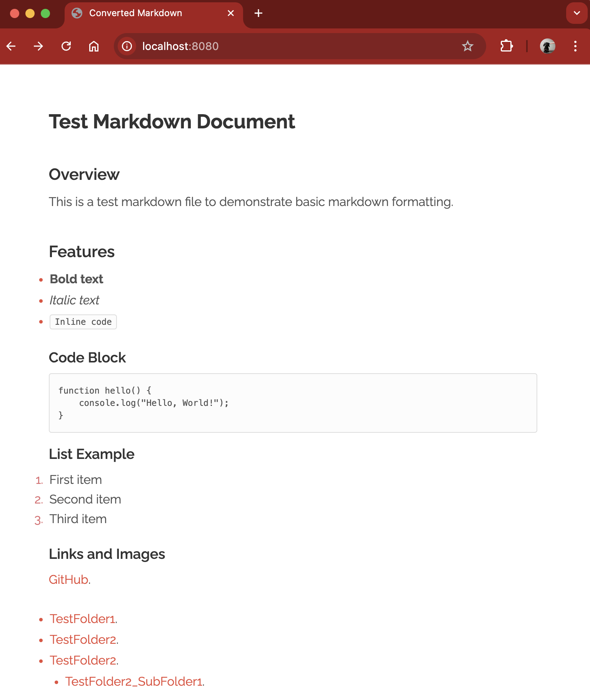

# AF\_Docs

A fast, lightweight static site generator that converts Markdown files to HTML using the MD4C library.



[](https://opensource.org/licenses/MIT)

## 📖 About The Project

This repository contains **AF\_Docs** - a simple yet powerful static site generator written in C. Key features include recursive directory processing, GitHub Flavored Markdown support, and an integrated HTTP preview server. This project aims to deliver a minimal, dependency-free solution for converting markdown documentation into deployable HTML websites.

---

## 📖 Getting Started

Follow these instructions to get a copy of the project up and running on your local machine for development and testing.

### Prerequisites

*   **GCC** or compatible C compiler
*   **Make** build system
*   **Git** (for cloning the repository)
*   A text editor for writing Markdown (e.g., Visual Studio Code, Vim, etc.)

### Installation

**Clone the repository:**

**Build the project:**

**Verify the build:**

*   The binaries will be created in the `bin/` directory:
    *   `bin/AF_Docs` - The markdown converter
    *   `bin/AF_HTTP` - The HTTP preview server

**Run your first conversion:**

---

## Features ✨

This project includes the following main features:

### Feature 1: **Recursive Markdown Processing**

*   **Description:** Automatically discovers and converts all `.md` files in a directory tree to `.html` files.
*   **Characteristics:**
    *   Preserves the original directory structure in the output
    *   Processes nested folders recursively
    *   Matches markdown filenames to HTML output (e.g., `index.md` → `index.html`)
    *   Skips non-markdown files automatically

### Feature 2: **GitHub Flavored Markdown Support**

*   **Description:** Full support for GitHub Flavored Markdown (GFM) features through the MD4C library.
*   **Characteristics:**
    *   Tables, strikethrough, and task lists
    *   Autolinks and URL autolinking
    *   Fenced code blocks with syntax highlighting support
    *   Fast and lightweight C-based parsing

### Feature 3: **Built-in HTTP Preview Server**

*   **Description:** Integrated HTTP server (AF\_HTTP) for instant local preview of generated sites.
*   **Characteristics:**
    *   Serves static HTML, CSS, and JavaScript files
    *   Automatic MIME type detection
    *   Security features including path traversal protection
    *   Lightweight with minimal dependencies

---

## Usage

After installation and building the project:

### Convert Markdown to HTML

```
./bin/AF_Docs [input_directory] [output_directory]
```

**Examples:**

```
# Use default directories (./docs → ./bin/public)
./bin/AF_Docs

# Custom directories
./bin/AF_Docs ./my-docs ./website

# Show help
./bin/AF_Docs --help
```

### Preview Your Site

```
cd bin/public
../AF_HTTP
```

Then open your browser to `http://localhost:8080`

**Key directory structure:**

*   `docs/` - Default input directory for markdown files
*   `bin/public/` - Default output directory for HTML files
*   `bin/AF_Docs` - Markdown converter binary
*   `bin/AF_HTTP` - HTTP preview server binary

---

## FAQ ❓

**"I get compilation errors when running** `**make**`**"**

*   **Check GCC version:** Ensure you have a modern GCC compiler installed (`gcc --version`)
*   **Missing headers:** Verify that standard C libraries are installed
*   **Submodules:** Run `git submodule update --init --recursive` to fetch dependencies

**"The converter doesn't find my markdown files"**

*   **Check file extensions:** Only `.md` files are processed
*   **Verify path:** Ensure the input directory path is correct and contains markdown files
*   **Permissions:** Check that the program has read access to the input directory

**"AF\_HTTP shows 404 errors"**

*   **Run from correct directory:** AF\_HTTP serves files from the current directory
*   **Check file paths:** Ensure HTML files exist in the directory you're serving
*   **CSS paths:** Verify that `markdown.css` is in the correct location relative to HTML files

---

## 📖 Branches

This repository uses the following branches:

*   `**main**`: Stable production branch containing the latest tested and released version.
*   `**dev**`: Active development branch. Contains new features and improvements being tested before merge to main.

---

## 📖 Contributing

Contributions and feedback are welcome!

If you have a suggestion that would make this better, please fork the repo and create a pull request. You can also simply open an issue with the tag "enhancement".

Don't forget to give the project a star! Thanks!

1.  Fork the Project
2.  Create your Feature Branch (`git checkout -b feature/AmazingFeature`)
3.  Commit your Changes (`git commit -m 'Add some AmazingFeature'`)
4.  Push to the Branch (`git push origin feature/AmazingFeature`)
5.  Open a Pull Request

---

## 📖 License

Distributed under the MIT License. See `LICENSE` for more information.

---

## 📖 Contact

jhall.develop - [@jhallDevelop](https://github.com/jhallDevelop)

Project Link: [https://github.com/jhallDevelop/AF_Docs](https://github.com/jhallDevelop/AF_Docs)

---

## 📖 Acknowledgments

*   **MD4C Library** - Martin Mitáš ([mity/md4c](https://github.com/mity/md4c)) - Fast and compliant Markdown parser
*   **AF\_HTTP** - Lightweight HTTP server for local development